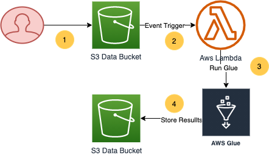

# hitlevelanalytics

This project gives the revenue generated for the company by external search domains, User will upload a Tab separated Hit Level logs to a S3 data buket ETL pipeline to calculate the revenue will be triggered and stores the final result with in same databukcet in '/out/ folder


## Highlevel Architechture


### Process
1. The ETL pipeline will be triggered when user uploads the tab delimited ```hit_level_logs``` to S3 data buckets in ```/input```
2. An event trigger will trigger for this new ```PUT``` or ```COPY``` or ```multi-partupload``` event to this bucket, This invokes a Lambda Function
3. ```hit_analysis_lambda_trig``` Lambda is invoked by ```PUT``` event above and triggers the Glue job for running the Analysis
4. ```HIT_LEVEL_ANALYSIS``` Glue job triggered by Lambda above runs the Analysis on the data in S3 bucket and stores the results to same S3 bucket.  